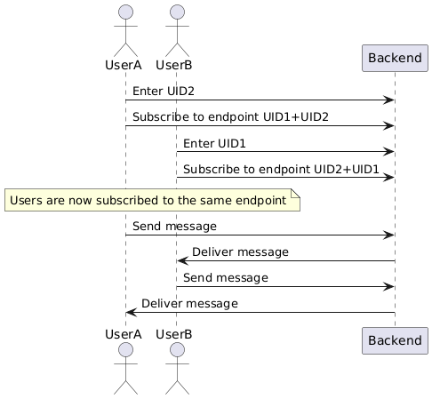

# 💬 Quick Chat - Chatting Application

A real-time multi-room chat application built with **Spring Boot**, **WebSockets**, **SockJS**, and **STOMP**. Multiple users can join named rooms and exchange messages instantly — no page refresh needed.

---

## Features

- Real-time messaging via WebSockets (STOMP protocol)
- **Multi-room support** — join any room by entering a Room ID
- SockJS fallback for browsers without native WebSocket support
- Clean, responsive UI with connection status indicator
- XSS-safe message rendering
- Runs on any machine (no hardcoded IPs)

---

## Tech Stack

| Layer     | Technology                          |
|-----------|-------------------------------------|
| Backend   | Spring Boot 3.4.0, Spring WebSocket |
| Protocol  | STOMP over SockJS                   |
| Frontend  | Vanilla JS, SockJS client, STOMP.js |
| Build     | Maven (Java 21)                     |
| Container | Docker (Eclipse Temurin 21 Alpine)  |


---

## Technologies Used

### Backend

- **Spring Boot** : Framework for creating the REST API and WebSocket server.

- **WebSockets** : Enables real-time, full-duplex communication between client and server.

- **SockJS** : Provides fallback support for browsers that do not support native WebSockets.

- **STOMP (Simple Text-Oriented Messaging Protocol)** : Used over WebSockets for structured message communication.

---

## System Design

The application follows a real-time communication model where:

- A **Spring Boot server** manages WebSocket connections
- Clients communicate using the **STOMP protocol**
- **SockJS** provides fallback support for browsers without native WebSocket support

### Architecture Flow

Below is the system design diagram illustrating the communication flow:



---

## How to Run

### Option 1 — Run the pre-built JAR (fastest)

> Requires: **Java 21+**

```bash
java -jar target/chat-0.0.1-SNAPSHOT.jar
```

Open your browser at: **http://localhost:3000**

---

### Option 2 — Build and run from source

> Requires: **Java 21+** and **Maven 3.8+** (or use the included `mvnw` wrapper)

```bash
# Clone / unzip the project, then:
cd Quick-Chat

# Build
./mvnw package -DskipTests

# Run
java -jar target/chat-0.0.1-SNAPSHOT.jar
```

Open your browser at: **http://localhost:3000**

---

### Option 3 — Docker

> Requires: **Docker**

```bash
# Build the image
docker build -t quick-chat .

# Run the container
docker run -p 3000:3000 quick-chat
```

Open your browser at: **http://localhost:3000**

---

### Option 4 — Change the port

To run on a different port, pass it as an argument:

```bash
java -jar target/chat-0.0.1-SNAPSHOT.jar --server.port=8080
```

---

## Deploying to Render

**Quick summary:**

1. Push your code to GitHub
2. Create a new **Web Service** on [render.com](https://render.com)
3. Connect your repo — Render auto-detects the Dockerfile
4. Click **Deploy** ✅

Your app will be live at `https://quickchat-f1tn.onrender.com`

---

## How to Use

1. Open **http://localhost:3000** in two or more browser tabs/windows.
2. Type a **Room ID** (e.g. `general`, `team-a`) and click **Join Room**.
3. Enter your **name** and start chatting.
4. All users in the same room see each other's messages in real time.
5. Users in different rooms do **not** see each other's messages.

---

## How It Works

1. **Connection Establishment**  
   Clients connect to the Spring Boot server using **WebSockets** or **SockJS** as a fallback.  
   The **STOMP protocol** is used for sending and receiving messages.

2. **Messaging**  
   Users send messages through the WebSocket connection.  
   The backend processes and broadcasts messages to the appropriate room subscribers.

3. **Fallback Support**  
   If WebSocket support is unavailable, **SockJS** enables communication using HTTP-based alternatives.

---

## Project Structure

```
src/
├── main/
│   ├── java/com/sts/
│   │   ├── ChatApplication.java          # Spring Boot entry point
│   │   ├── config/
│   │   │   └── WebSocketConfig.java      # WebSocket + STOMP broker config
│   │   ├── controller/
│   │   │   └── ChatController.java       # Handles incoming messages & broadcasts
│   │   └── model/
│   │       └── ChatMessage.java          # Message model (sender, content, recipient)
│   └── resources/
│       ├── application.properties        # Server config (port, logging)
│       └── static/
│           └── index.html                # Frontend chat UI
```

---

## WebSocket API

| Direction        | Destination                       | Description                          |
|------------------|-----------------------------------|--------------------------------------|
| Client → Server  | `/app/{roomID}/sendMessage`       | Send a message to a room             |
| Server → Client  | `/topic/{roomID}/messages`        | Subscribe to receive room messages   |

**Message payload (JSON):**
```json
{
  "sender": "Alice",
  "content": "Hello everyone!",
  "recipient": "general"
}
```

---

## Configuration

Edit `src/main/resources/application.properties`:

```properties
server.port=3000                          # Change the port
logging.level.com.sts=DEBUG              # Enable debug logs
```

---


## 📄 License

This project is open source and available under the [MIT License](LICENSE).

---

## Contributing

Contributions are welcome!

1. Fork the repository
2. Create a new branch (`feature/your-feature`)
3. Commit your changes
4. Push to your branch
5. Open a Pull Request 

---
